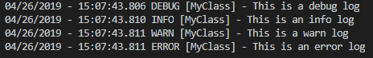
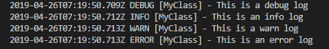
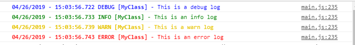
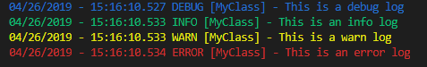

### To install
```
npm install --save logbok
```
### To create a logger for a class
```typescript
export class MyClass {
    ...
    private static readonly logger = Logbok.getLogger(MyClass);
    ...
}
```

### Or for a vanilla javascript function
```typescript
...
var logger;

function myFunction() {
    ...
    logger = logger || Logbok.getLogger(myFunction);
    ...
}
...
```

### To log specific messages
```typescript
logger.debug('this is a debug log');
logger.info('this is an info log');
logger.warn('this is a warn log');
logger.error('this is an error log');
```

## Configurations
Logbok reads the specified configuration from its `CONFIG` property.
<br/>Currently supported configurable parameters are `log-level`, `disabled-loggers`, and `log-appenders`.

---
|ATTRIBUTE|TYPE|<div style='text-align: center;'>DESCRIPTION</div>|SAMPLE USAGE***|
|:---:|:---:|:---|:---:|
|*log-level*|string|can be either `debug`, `info`, `warn`, and `error` - with `debug` as the lowest and `error` as the highest level, respectively - initially set to `debug`.|```Logbok.CONFIG['log-level'] = 'debug'```|
|*disabled-loggers*|array|contains the list of the classes/types whose loggers will be disabled - initially set to empty.|```Logbok.CONFIG['disabled-loggers'] = [MyClass]```|
|*log-appenders*|array|contains the list of instances of log appenders to be used - initially set to empty.<br/>Currently, Logbok provides 5 appenders, namely, `ConsoleLogAppender`, `ChromeConsoleLogAppender`, `NodeConsoleLogAppender`, `IsoTimestampAppender`, and `RollingFileAppender`|```Logbok.CONFIG['log-appenders'] = [ new ChromeConsoleLogAppender(), new CustomLogAppender() ]```|
---

***_Note: All of the above mentioned attributes are configured in a way that when a new value is assigned, the changes will be applied immediately._

## Creating a custom log appender
If the provided appenders are insufficient, you can extend those and/or make your own log appender for your own specific usecase.
<br/>You just need to implement the `Appender` interface like below:
```typescript
// this is a blunt angular sample for a remote log appender implementation
export class RemoteLogAppender implements Appender {
    readonly appenderName = 'RemoteLogAppender';
    private static readonly chromeConsoleLogAppender = new ChromeConsoleLogAppender();

    log(logEntry: LogEntry): void {
        const message = logEntry.buildLogString('');
        this.http.post('https://log/service/url', message, /*httpOptions*/).subscribe(() => {
            this.chromeConsoleLogAppender.log(logEntry);
        });
    }
}
...
// then somewhere up the initialization phase
Logbok.CONFIG['log-appenders'] = [ new RemoteLogAppender() ]
```
For reference purposes, the appender interface is defined in Logbok as
```typescript
export interface Appender {
    readonly appenderName: string;
    log(logEntry: LogEntry): void;
}
```
## Sample Codes
Vanilla javascript code snippet for Node JS:

```javascript
var { Logbok, ConsoleLogAppender } = require("logbok");

var logger;

function myFunction() {
   logger = logger || Logbok.getLogger(myFunction);
   logger.info('this is an info log');
}

Logbok.CONFIG['log-appenders'] = [new ConsoleLogAppender()]

myFunction(); // prints something like "04/24/2019 - 15:30:29.958 INFO [myFunction] - this is an info log"
```

Code snippet for Typescript:
```typescript
import { Logbok, ConsoleLogAppender } from "logbok";

export class MyClass {
    private static readonly logger = Logbok.getLogger(MyClass);

    log() {
        MyClass.logger.info('this is an info log');
    }
}

Logbok.CONFIG['log-appenders'] = [ new ConsoleLogAppender() ];
new MyClass().log(); // prints something like "04/24/2019 - 15:46:33.891 INFO [MyClass] - this is an info log"
```

### Log Appenders
Logbok comes with 5 core log appenders, namely, `ConsoleLogAppender`, `ChromeConsoleLogAppender`, `NodeConsoleLogAppender`, `IsoTimestampAppender`, and `RollingFileAppender`. Each one has a different usecase but some can be used in conjunction with one another (e.g. `RollingFileAppender` can be paired with either of the three: `ConsoleLogAppender`, `NodeConsoleLogAppender`, `IsoTimestampAppender`).

- #### ConsoleLogAppender
   This is the most basic log appender among all logbok appenders.<br/>
   This one is built on top of the console object, hence the name.<br/>
   No magic and all, just plain text pre-formatted to look like a decent log message.<br/>
   Below is a sample snippet of the output of a ConsoleLogAppender.

   

- #### IsoTimestampAppender
   This one is time-formatted version of ConsoleLogAppender.<br/>
   No magic and all, just plain text with pre-formatted time to look like a decent log message.<br/>
   Below is a sample snippet of the output of a IsoTimestampAppender.

   

- #### ChromeConsoleLogAppender
   This one is a color-coded version of ConsoleLogAppender dedicated for Chrome/Chrome-based renderer apps (e.g. Electron) <br/>
   Below is a sample snippet of the output of a ChromeConsoleLogAppender.

   

- #### NodeConsoleLogAppender
   This one is similar to ChromeConsoleLogAppender in the manner that it is also a color-coded version of ConsoleLogAppender.<br/>
   The only difference is that this one is for the command line/terminal window console instead of the chrome. <br/>
   Below is a sample snippet of the output of a NodeConsoleLogAppender.

   

- #### RollingFileAppender
   This one is more advanced compared to the other types of appender. The idea is that it redirects logs to a file instead of using a console object.<br>
   Currently, this can only be used by backend codes, as it requires collocation of the log file with the running instance.<br>
   This appender can be instantiated with the following optional parameters:

   
   |NAME|TYPE|DESCRIPTION|REMARKS|
   |---|---|---|---|
   |_filePath_|string| the path of the file where to write the logs, creates it if it does not exist yet | default value is './logbok.log'
   |_rolloverOption_|RolloverOption| the rollover mechanism describing when to rename the current log file with a new rollover filename. _see below description of possible values_| naming follows counting numbers starting from 1, e.g. for filepath='./server.log' rollover files will be server-1.log, server-2.log, and so on.

   ```typescript
    export declare interface RolloverOption {
        size?: RolloverSize,
        sizeInKiB?: number
        sizeInMiB?: number,
        sizeInGiB?: number,
        timeInterval?: RolloverTime,
        timeIntervalInSeconds?: number,
        timeIntervalInMinutes?: number,
        timeIntervalInHours?: number
    }

    export enum RolloverTime {
        HOURLY,
        DAILY,
        WEEKLY,
        MONTHLY
    }

    export enum RolloverSize {
        TEN_MiB, // is equal to (10 * 1024 * 1024) bytes
        FIFTY_MiB, // is equal to (5 * TEN_MiB) bytes
        HUNDRED_MiB, // is equal to (10 * TEN_MiB) bytes
        ONE_GiB, // is equal to (10 * 1024 * 1024 * 1024) bytes
        TEN_GiB // is equal to (10 * TEN_GiB) bytes
    }
   ```
   Below are sample rollover configurations
   ``` typescript
    new RollingFileAppender('./server.log', { size: RolloverSize.TEN_MiB })       // rolls over everytime log file reaches 10MiB
    new RollingFileAppender('./server.log', { sizeInKiB: 100 }                    // rolls over everytime log file reaches 100KiB
    new RollingFileAppender('./server.log', { timeInterval: RolloverTime.HOURLY } // rolls over every 1 hour
    new RollingFileAppender('./server.log', { timeIntervalInSeconds: 10 }         // rolls over every 10 seconds
   ```

   